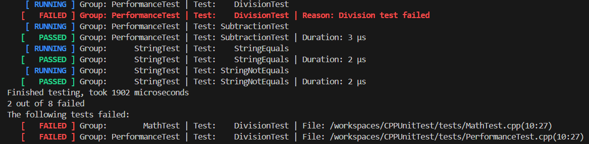

# CPPUnitTest
CPPUnitTest is a lightweight and modern C++ testing framework designed for projects built with C++23,  modules and Clang, offering multithreaded test execution, expressive logging, and powerful assertion utilities. With a simple interface and robust features, CPPUnitTest aims to streamline the development and testing process while maintaining readability and performance.

# Key Features
- Built with C++23 and modules: Modern, headerless architecture; avoids exporting macros and leverages C++23's power.
- Multithreaded test execution: Run tests simultaneously to save time and maximize efficiency.
- Simple and informative logging: Clear, concise output with links to the location of failed tests.
- Organize tests into groups and names: Logical structuring of tests for easier management and debugging.
- Comprehensive assertions: A suite of intuitive assertion methods to validate your code.

# Getting Started
## Installation
Clone the repository into your project:
```bash
git clone https://github.com/jonathanbogerd/CPPUnitTest.git
```
Add CPPUnitTest to your project:
```cmake
add_subdirectory(CPPUnitTest)
target_link_libraries(your_project PRIVATE CPPUnitTest)
```

## Clang Compiler
CPPUnitTest was built and tested with Clang 19.1.4. Due to differences in module implementation between the compilers, it will probably not work with GCC or MSVC.

## Writing Tests
Creating a test is simple. Use the TestRegister class to register your tests with the framework.

Here's an example of a performance test named "AdditionTest":
```cpp
const static TestRegister test_addition(
    "PerformanceTest",       // Group name
    "AdditionTest",          // Test name
    true,                    // Multithreaded execution
    [] {                     // Lambda containing the test logic
        int a = 2;
        int b = 2;
        assert_eq(4, a + b, "Addition test failed");
    });
```

## Assertions
The following assertions are available for your test logic:

- **`assert_eq(expected, actual, message)`**  
  Ensures that `expected == actual`.  
  **Example:**  
  ```cpp
  assert_eq(4, a + b, "Addition test failed");
  ```
- **`assert_nq(expected, actual, message)`**  
  Ensures that `expected != actual`.  
  **Example:**  
  ```cpp
  assert_nq(5, a + b, "Values should not be equal");
  ```

- **`assert_true(condition, message)`**  
  Ensures that condition is true.  
  **Example:**  
  ```cpp
  assert_true(a > b, "Condition is false");
  ```
- **`assert_false(condition, message)`**  
  Ensures that condition is false.  
  **Example:**  
  ```cpp
  assert_false(a > b, "Condition is true");
  ```

- **`assert_throws<ExceptionType>(lambda, message)`**  
  Ensures that the lambda throws the specified exception type.  
  **Example:**  
  ```cpp
  assert_throws<std::runtime_error>(
    [] { throw std::runtime_error("Error"); },
    "Expected runtime_error was not thrown");
  ```

# Running Tests
CPPUnitTest provides intuitive and informative logging during test execution.

## Multithreaded Execution
Tests can be executed in parallel for performance optimization. Simply set the multithreaded flag (true) when registering the test.

## Example Output
When you run your tests, the output provides detailed information about the execution: \


# Organizing Tests
CPPUnitTest allows grouping tests under logical names using the group_name parameter. This helps structure your test suite and filter tests based on their group.

Example:

```cpp
import CPPUnitTest;
const static TestRegister test_group1(
    "MathOperations", "AdditionTest", true, [] { /* Test logic */ });

const static TestRegister test_group2(
    "MathOperations", "SubtractionTest", true, [] { /* Test logic */ });

const static TestRegister test_group3(
    "ErrorHandling", "DivisionByZeroTest", true, [] { /* Test logic */ });
```

# Example Project Structure
Here's an example of a typical project structure using CPPUnitTest:

your_project/ \
├── src/ \
│   └── main.cpp \
├── tests/ \
│   ├── MathTests.cpp \
│   ├── PerformanceTests.cpp \
│   └── ErrorHandlingTests.cpp \
├── CMakeLists.txt \
└── CPPUnitTest/ \
    ├── src/ \
    │   ├── CPPUnitTest.cpp \
    │   ├── TestManager.cpp \
    │   ├── TestRegister.cpp \
    │   └── Assert.cpp \
    ├── CMakeLists.txt \
    └── LICENSE

# License
CPPUnitTest is licensed under the MIT License. See the [LICENSE](LICENSE) file for details.